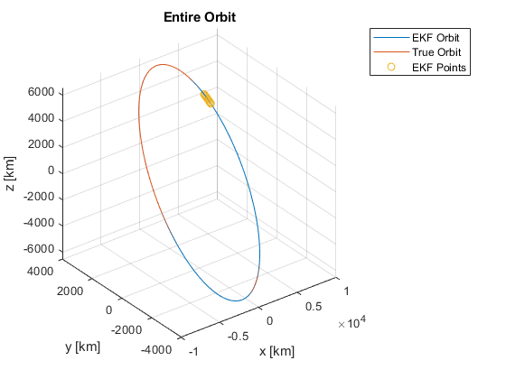
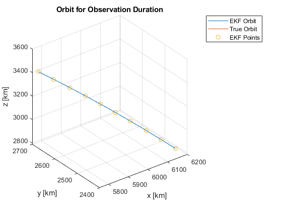
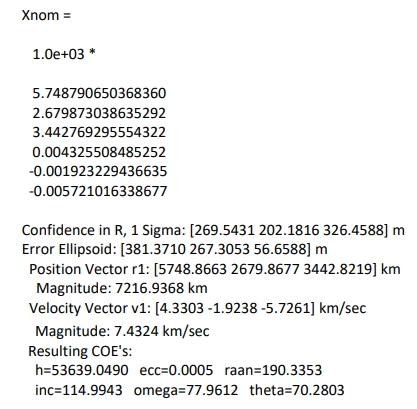
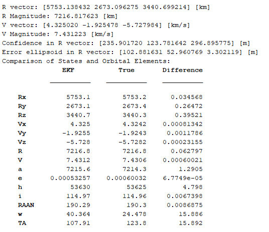

# Application of Extended Kalman Filter to Orbit Determiation

The extended Kalman filter was applied to an initial orbit determination problem done by non-linear weighted least squares method in order to improve the error ellipsoid.

## Presentation

Please visit: https://portfolium.com/entry/extended-kalman-filter-in-orbit-determination for the presentation on how this code was developed.

## Code

The main script can run on its own to generate the solution, but I have also included all the functions separately as well.

## Results

Dr.A's Results | My Results
-------------- | ----------
 | 

## References Used
* Vallado, D. A., and McClain, W. D., Fundamentals of astrodynamics and applications, El Segundo, CA: Microcosm Press, 2001.
* “Initial Orbit Determination (Extended Kalman Filter) - File Exchange - MATLAB Central,” Initial Orbit Determination (Extended Kalman Filter) - File Exchange - MATLAB Central Available: https://www.mathworks.com/matlabcentral/fileexchange/55627-initial-orbit-determination-extended-kalman-filter.
* Keil, E. M., “Kalman Filter Implementation to Determine Orbit and Attitude of a Satellite in a Molniya Orbit” Available: https://vtechworks.lib.vt.edu/bitstream/handle/10919/49102/Keil_EM_T_2014.pdf?sequence=1&isAllowed=y.
